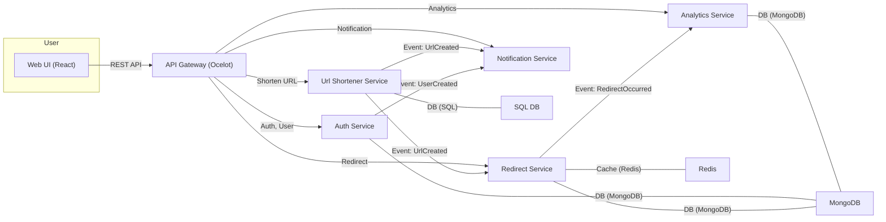

# URL Shortener Microservices Project

This project implements a scalable URL Shortener system using a microservices architecture. It includes services for authentication, URL shortening, redirection, analytics, notifications, and a web frontend. The structure follows best practices for maintainability and CI/CD.

## Architecture Diagram

## Service Descriptions

### 1. API Gateway (Ocelot)
- **Tech:** ASP.NET Core, Ocelot
- **Role:** Entry point for all client requests. Routes, aggregates, and secures traffic to backend services.
- **Features:**
  - Centralized routing
  - Authentication/authorization delegation
  - Rate limiting, logging, CORS

### 2. Auth Service
- **Tech:** Node.js, Express, Passport.js
- **Role:** User management, authentication (login/register), and authorization (roles, JWT).
- **Features:**
  - Register, login, manage users
  - Issues JWT tokens
  - Publishes `UserCreatedEvent` to RabbitMQ
- **Database:** MongoDB

### 3. Url Shortener Service
- **Tech:** ASP.NET Core
- **Role:** Core logic for creating and managing short URLs.
- **Features:**
  - Generate unique short codes
  - Store mappings (short code <-> original URL)
  - Publishes `UrlCreatedEvent` to RabbitMQ
- **Database:** SQL

### 4. Redirect Service
- **Tech:** Node.js, Express, Redis
- **Role:** Handles redirection from short code to original URL, with caching.
- **Features:**
  - Lookup short code in Redis cache, fallback to DB
  - Publishes `RedirectOccurredEvent` to RabbitMQ
  - Consumes `UrlCreatedEvent` for cache warm-up
- **Database:** MongoDB with Redis caching

### 5. Analytics Service
- **Tech:** Node.js, Express, MongoDB
- **Role:** Collects and stores click statistics for short URLs.
- **Features:**
  - Consumes `RedirectOccurredEvent` from RabbitMQ
  - Provides analytics API (clicks, stats)

### 6. Notification Service
- **Tech:** Node.js, Express, Nodemailer
- **Role:** Sends notifications (e.g., email) to users.
- **Features:**
  - Consumes events (`UserCreatedEvent`, `UrlCreatedEvent`)
  - Sends welcome emails, notifications

### 7. Web UI
- **Tech:** React.js
- **Role:** User-facing frontend for interacting with the system.
- **Features:**
  - Register/login, shorten URLs, view analytics
  - Dashboard for managing links

## Structure

- `.github/` - GitHub Actions workflows for CI/CD
- `src/` - Source code for all microservices and frontend
- `shared/` - Shared libraries and contracts
- `tests/` - Unit and integration tests for all services
- Configuration and formatting files for .NET, Node.js, and React
- `docker-compose.yml` for local development
- `.editorconfig`, `stylecop.json`, `.eslintrc.json`, `.prettierrc.json`, `.prettierignore` for code style
- `CONTRIBUTING.md` for contribution guidelines

See the full directory tree in the documentation for details.